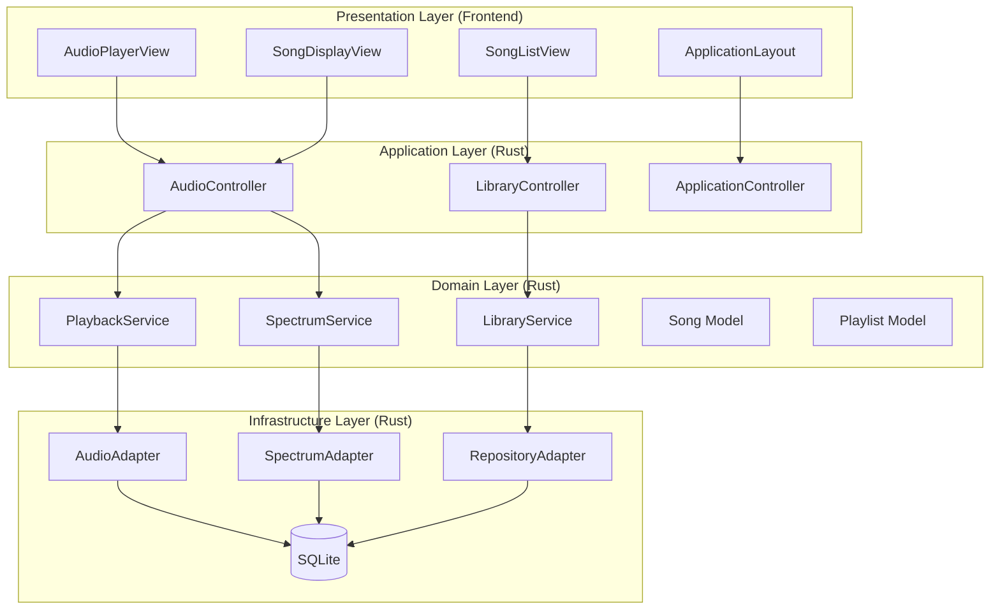
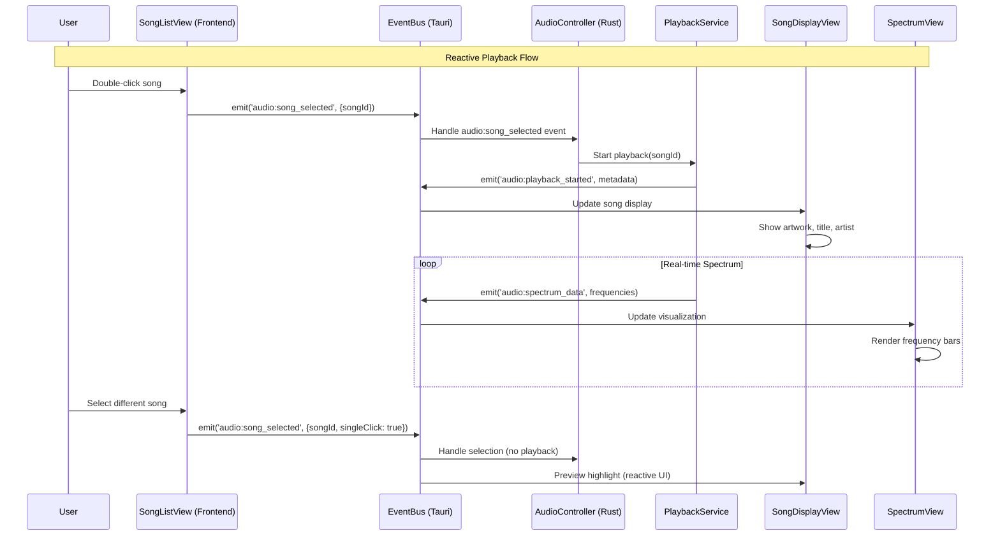
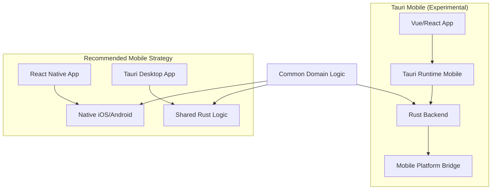
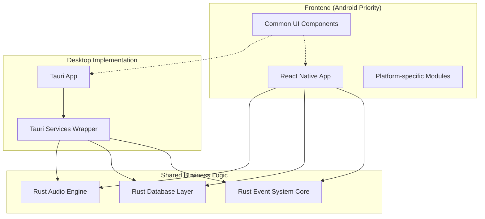

# 🎵 Tunes4R Architecture Document

## 📖 Overview

Tunes4R recreates Tunes4J's reactive MVC architecture using Tauri, leveraging web technologies for the UI and Rust for high-performance backend operations. The system implements Domain-Driven Design (DDD) principles with bounded contexts communicating via an event-driven Observer Pattern.

### Core Architectural Principles

- **Reactive MVC Architecture**: Event-driven communication between components
- **Bounded Contexts**: Domain separation (Audio, Library, Application)
- **Observer Pattern**: Tauri's event system for cross-component coordination
- **Web UI + Native Backend**: Modern frontend with performant Rust processing
- **DDD Principles**: Domain models with clear business logic boundaries

### Technology Architecture

```mermaid
graph TD
    A[Frontend (Vue.js/React)]
    B[Tauri Runtime]
    C[Rust Backend Core]
    D[Audio Engine]
    E[Spectrum Processing]
    F[Database Layer]
    G[Event System]

    A --> B
    B --> C
    C --> D
    C --> E
    C --> F
    G --> C
    G --> A
```

## 🏗️ Bounded Contexts Architecture

### Domain Separation Strategy

The system follows DDD bounded contexts to ensure clean separation of concerns while maintaining reactive communication.



## 🔄 Reactive Event Flow Architecture

### Observer Pattern Implementation

The event system enables loose coupling between bounded contexts through Tauri's asynchronous event emission.



### Event Matrix

| Source Component | Event Type | Consumer Components | Effect |
|------------------|------------|-------------------|---------|
| **SongListView** | `audio:song_selected` (double) | AudioController | Immediate playback start |
| **SongListView** | `audio:song_selected` (single) | AudioController | Load preview, no playback |
| **AudioController** | `audio:playback_state` | All UI Views | Update play/pause icons |
| **PlaybackService** | `audio:spectrum_data` | SpectrumView | Update visualization |
| **PlaybackService** | `audio:progress` | ProgressBar | Update seek bar |
| **ThemeManager** | `ui:theme_changed` | All Views | Apply new theme colors |

## 📱 Mobile Development Considerations

### Is Tauri Mobile Support Doable for Production?

**✅ Android First Priority**: Possible but with caveats
**⚠️ Production Readiness**: Currently experimental/development stage
**🎯 Recommendation**: Evaluate production requirements vs. experimental status

### Mobile Architecture Alternatives



#### Tauri Mobile Assessment

**✅ Advantages:**
- Unified codebase (Web + Mobile + Desktop)
- Reuse React/Vue components
- Same backend Rust logic
- Consistent API design

**❌ Current Limitations (as of 2025):**
- Android support: Alpha stage
- iOS support: Experimental
- Limited platform APIs access
- Performance concerns on resource-constrained devices
- Small ecosystem vs. established mobile frameworks

**🔄 Mobile Readiness Timeline:**
- **Android**: Beta-ready in 2026
- **iOS**: Limited support, App Store challenging
- **Production Use**: 2026-2027 for stable releases

### Recommended Mobile Strategy

**Phase 1: Android (Immediate Feasibility)**
- Start with React Native or Flutter for proven mobile development
- Share business logic via Rust FFI libraries
- Tauri for desktop, separate mobile app

```rust
// Shared audio logic via Rust library
#[no_mangle]
pub extern "C" fn create_audio_engine(sample_rate: f32) -> *mut AudioEngine {
    // Common audio processing logic
    // Used by Tauri AND mobile apps via FFI
}
```

**Phase 2: Unified Development (Future)**
- When Tauri mobile stabilizes (likely 2026+)
- Migrate to single codebase if performance acceptable
- Evaluate user feedback and technical requirements

### Technical Implementation for Mobile

#### Android Priority Implementation Plan:
1. **Cross-platform Eval**: React Native/Flutter vs Tauri Mobile
2. **Architecture**: Decide on shared Rust libraries vs separate apps
3. **API Design**: WebSocket or HTTP APIs for communication
4. **Testing**: Focus on Android device variety and performance

#### Architecture for Mobile-First Development:



**Decision Point**: For immediate Android development, recommend React Native with shared Rust libraries to leverage existing Tauri work while ensuring mobile production readiness.

## 🔧 Component Communication Patterns

### Frontend-Backend Interaction

```rust
// Tauri commands for synchronous operations
#[tauri::command]
async fn play_song(song_id: String, state: State<AppState>) -> Result<(), String> {
    // Direct Rust operation
    let audio_ctrl = &state.audio_controller;
    audio_ctrl.play_song(song_id).await?;
    Ok(())
}

// Event emission for reactive updates
#[tauri::command]
async fn start_playlist(app_handle: AppHandle, playlist_id: String) -> Result<(), String> {
    app_handle.emit_all("playlist_started", &playlist_id)?;
    Ok(())
}
```

```javascript
// Frontend event listening
import { listen } from '@tauri-apps/api/event';

listen('spectrum_data', (event) => {
  // Reactive UI update
  spectrumBars.value = event.payload.frequencies;
});

// Command invocation
import { invoke } from '@tauri-apps/api/tauri';

await invoke('play_song', { songId: selectedSong.id });
```

## 🚨 Risk Assessment for Mobile Development

### High Priority Risks:
1. **Aurora Risks**:
   - Immature mobile platform support
   - Resource constraints on mobile vs desktop
   - Platform-specific limitations

2. **Technology Stack Risks**:
   - Web UI performance on mobile devices
   - Limited access to native device APIs
   - App store approval challenges (especially iOS)

3. **Business Risks**:
   - Delayed time-to-market for mobile version
   - User adoption and engagement differences
   - Maintenance complexity of dual-codebase approach

### Mitigation Strategies:

**For Immediate Development:**
- Prototype with React Native for Android MVP
- Create technical proof-of-concept with Tauri mobile
- Plan migration path to unified Taurí mobile when stable

**Architecture Safeguards:**
- Keep desktop and mobile versions separate initially
- Design shared Rust libraries for business logic
- Use feature flags for platform-specific adaptations

## 📋 Implementation Roadmap

### Mobile-Aware Development Phases:

**Phase 1**: Desktop-First Tauri Implementation (4-6 weeks)
**Phase 2**: Mobile Strategy Evaluation (2 weeks)
**Phase 3**: Android MVP with React Native (6-8 weeks)
**Phase 4**: iOS Implementation (4-6 weeks)
**Phase 5**: Unified Codebase Migration (Future - Taurí Mobile v1.0)

**Recommended Approach**: Start with proven mobile technologies (React Native for Android) while building the desktop version, then evaluate Taurí mobile stability for potential codebase unification.

This strategy ensures working mobile versions in the near term while positioning for future unified development if Tauri mobile proves production-ready.
